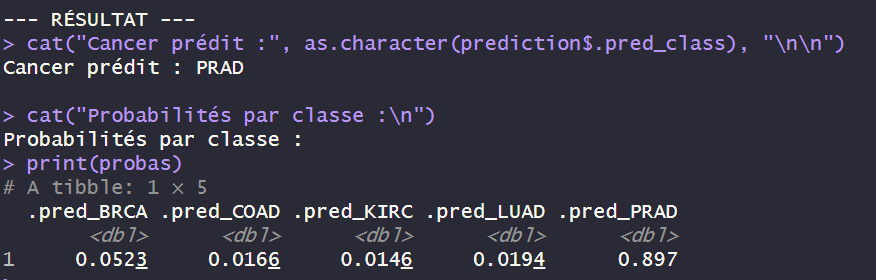
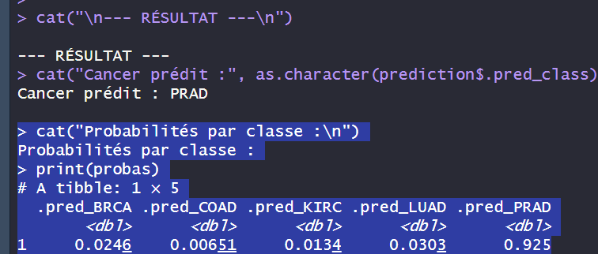
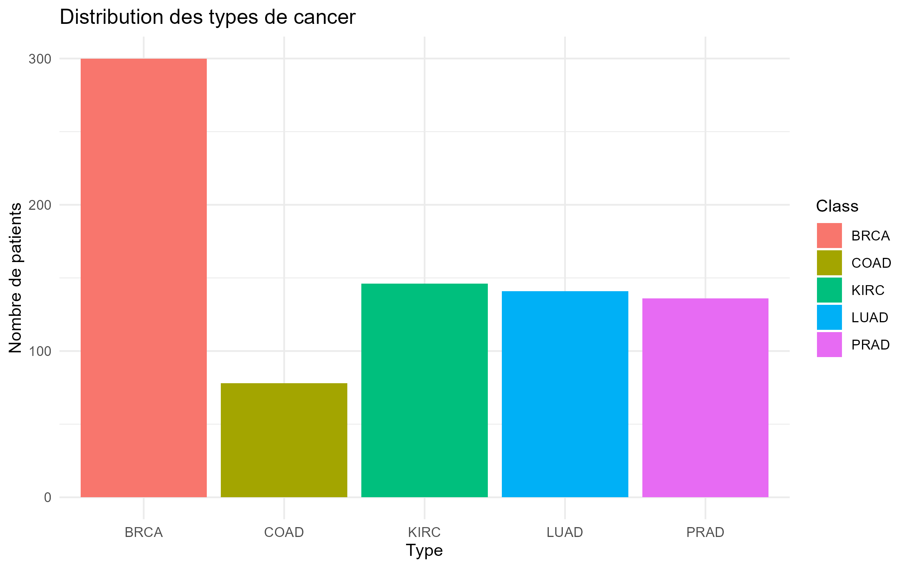

# Cancer Type Classification from RNA-Seq Data

Cancer type classification from gene expression data using R, tidymodels and Random Forest.

This project explores the classification of five cancer types from RNA-Seq gene expression data. It was developed in two versions, with the second version improving the evaluation and organization of the first one.

> This is an academic project for learning data analysis and machine learning. It is not intended for medical diagnosis.

## Dataset

- **Patients:** 801
- **Genes:** approximately 20,531
- **Classes:** BRCA, COAD, KIRC, LUAD, PRAD
- **Data:** gene expression values + cancer labels

## Source data

Kaggle [Salmanthecodepro](https://www.kaggle.com/datasets/salmanthecodepro/gene-expression-cancer-rna-seq-levels)
License MIT

## Version 1

The first version implements a complete Random Forest classification pipeline:

1. Data import and cleaning
2. Train/test split (75/25)
3. Gene preprocessing and normalization
4. Random Forest classification with 500 trees
5. Accuracy and confusion matrix
6. Gene importance analysis
7. Prediction of a new patient

The model can also return the predicted cancer type and the probability for each class.

### Limitations

The model was evaluated using a single train/test split. Results were not automatically saved, and the script initially relied on absolute file paths.
Furthermore, I found a certainty value of 1 (which was highly suspicious) so it was almost certain that my model was flawed.

## Version 2 — Improved

The second version keeps the same classification pipeline but adds:

- **5-fold cross-validation** (5 egal parts of initial 75%)
- Accuracy and ROC-AUC evaluation
- Automatic saving of cross-validation results
- Automatic saving of generated plots

### Limitations

The second version still uses absolute file paths and requires the new patient data to have the expected gene structure. A future version could make the project more reproducible by using relative paths and add automatic input validation and a simple interface for new patient predictions.

The model also seems to me to be performing too well; I suspect a risk of overfitting that could potentially have skewed the results.

### Cancer type distribution

## Result
In first version, we find 89 % of chance for random patient to have prad and in second, we have 91 % of chance for prad. Result is coherent and with a certitude of approxymatelis 99 of certitude.

## How to use

1. Place the required CSV files in the project directory.
2. Open the R script in RStudio.
3. Modify the file paths if necessary.
4. Install the required packages.
5. Run the script.

Required packages:

library(tidyverse)
library(tidymodels)
library(ranger)

## Purpose

This project was developed as coursework to pratice R programming, data analysis and above all machine learning on high-dimensional biological data.

The two versions show the progression from a first working classification model to an improved version with cross-validation and automated result saving.

## Author

**Simon Duramps**
L1 Life Sciences – Université de Pau et des Pays de l'Adour (UPPA)
